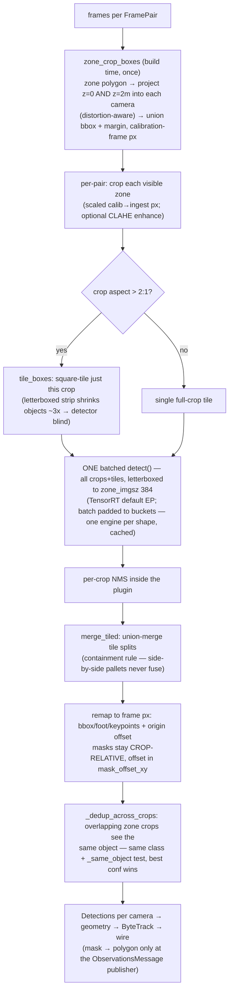

# Detection — zone-scoped pipeline & key functions

**WHY** — objects only matter inside floor zones; a cropped far zone gets more model pixels. No zones ⇒ pose-only. Pose stays global.

**WHAT** — `ZoneScopedDetector` (`backbone/detection/zone_scope.py`) wraps any `Detector` plugin; not a plugin seam.

## Function cheat table

| Function / class | File | What |
|---|---|---|
| `ZoneScopedDetector.detect(pair)` | `backbone/detection/zone_scope.py` | crop → tile → one batch → merge → remap → dedup |
| `zone_crop_boxes(rig, zones, crop_height_m=2.0, margin_px=16, min_side_px=48)` | `zone_scope.py` | build-time crop boxes; polygon at z=0 + z=2 m |
| `_dedup_across_crops(dets)` | `zone_scope.py` | one det per object across overlapping crops; best conf wins |
| `tile_boxes(w, h, tile, overlap)` | `backbone/detection/tiling.py` | SAHI tiles; overlap must exceed largest object |
| `merge_tiled(dets, iou_thresh=0.5)` / `_same_object` | `tiling.py` | union-merge tile splits; containment rule — neighbors never fuse |
| `shift_detection(d, dx, dy)` | `tiling.py` | translate box/foot/keypoints/mask-origin in place |
| `YoloOnnxDetector` (+ `_seg`, `_pose`) | `backbone/detection/yolo_onnx*.py` | ORT plugin; TRT default EP (2.1–2.3×), cache `models/.trt_cache` |
| `detector_registry` | `backbone/core/interfaces.py` | the seam; orchestrator wraps `detection.plugin` |
| `clip_to_zones_metric(dets, view, display_wh, zones)` | `monitor_web/monitor_web/zone_projection.py` | show det only when its foot is in a zone (metric test) |
| `zone_of_foot_metric(view, display_wh, zones, foot_uv)` | `zone_projection.py` | **the ONE rule**: foot → undistort + `H` → floor → polygon ± `_ZONE_TOL_M = 0.15 m` |
| `project_zone_hulls(rig, zones, camera_id)` | `zone_projection.py` | draw z-extruded zone hull on cam view |

## Key mechanics

!!! note "TRT batch bucketing"
    One engine per input shape ⇒ pad the batch to the next bucket (duplicates discarded). Few engines, cached forever.

!!! note "Masks stay crop-relative"
    Mask + `mask_offset_xy`, never full-frame canvas; polygonized only at the wire (`ObservationDet.mask_poly`).

!!! warning "Pose is different"
    `yolo_onnx_pose` runs global full-frame. Persons ride the wire as `cls="person"` + `keypoints_uv`; the dashboard renders skeletons with zero inference.

**Config** (`backbone.yaml → detection:`): `scope: zones|full_frame`, `zone_imgsz: 384` (dynamic ONNX), `decode_masks`, `trt_enabled`, SAHI + CLAHE blocks, `_MAX_CROP_ASPECT = 2.0`.
