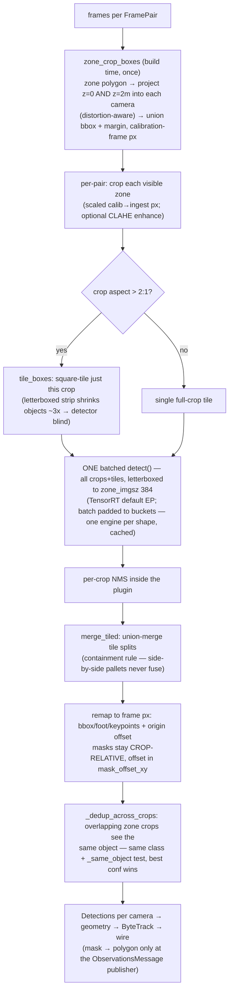

# Detection — zone-scoped pipeline & the functions that matter

**WHY** — the system is **zone-based**: objects only matter inside configured floor zones, so the detector should only *see* the zones. A small far zone letterboxed into its own crop gets **more model pixels** than it would inside the full frame — accuracy up, compute down. No zones configured ⇒ no object detector at all (pose-only Backbone). The person-pose model stays **global** — safety needs eyes everywhere.

**WHAT** — `ZoneScopedDetector` (`backbone/detection/zone_scope.py`) wraps any `Detector` plugin; deliberately **not** a plugin seam (one sensible way to scope detection to zones).

## Function cheat table

| Function / class | File | What / why |
|---|---|---|
| `ZoneScopedDetector.detect(pair)` | `backbone/detection/zone_scope.py` | Crops zones, tiles extreme aspects, one batched inference, merge + remap + dedup. Downstream untouched. |
| `zone_crop_boxes(rig, zones, crop_height_m=2.0, margin_px=16, min_side_px=48)` | `zone_scope.py` | Build-time `{cam: [(zone, box)]}` — polygon projected at z=0 **and** z=2 m (a loaded pallet has height), Mode 1 extends the floor bbox upward as stand-in; invisible/tiny zones skipped. |
| `_dedup_across_crops(dets)` | `zone_scope.py` | One detection per physical object per camera: the z-extrusion makes neighboring crops overlap heavily, so per-crop NMS can't see the duplicate — this can. |
| `tile_boxes(w, h, tile, overlap)` | `backbone/detection/tiling.py` | SAHI slicing: overlapping tile rects at ~model scale; overlap must exceed the largest object so one tile sees it whole. |
| `merge_tiled(dets, iou_thresh=0.5)` / `_same_object` | `tiling.py` | Union-merge one object split across tiles — IoU **or** center-containment **or** intersection>60% of smaller. Containment-based on purpose: adjacent pallets never stitch. |
| `shift_detection(d, dx, dy)` | `tiling.py` | Translate box/foot/keypoints/mask-origin in place (tile → crop coords). |
| `YoloOnnxDetector` (+ `yolo_onnx_seg`, `yolo_onnx_pose`) | `backbone/detection/yolo_onnx*.py` | ONNX Runtime plugin; **TensorRT default EP** (2.1–2.3× over CUDA EP), engines cached in `models/.trt_cache` — first build per shape takes minutes, cached forever. |
| `detector_registry` | `backbone/core/interfaces.py` | The seam: `@detector_registry.register("yolo_onnx")`; orchestrator composes `ZoneScopedDetector` *around* whichever plugin `detection.plugin` names. |
| `clip_to_zones_metric(dets, view, display_wh, zones)` | `monitor_web/monitor_web/zone_projection.py` | Consumer-side: show a detection only when its **foot** lands in a zone — metric test beats pixel-polygon tests (per-camera projections disagree in pixels, agree on the floor). |
| `zone_of_foot_metric(view, display_wh, zones, foot_uv)` | `zone_projection.py` | **The ONE membership rule**: foot → undistort + `H` → floor (X, Y) → nearest `zones.yaml` polygon within `_ZONE_TOL_M = 0.15 m`. Real feet miss by 0.05–0.11 m, crop junk sits 0.38 m+ out — 0.15 splits cleanly. |
| `project_zone_hulls(rig, zones, camera_id)` | `zone_projection.py` | Draw the z-extruded zone hull on the cam view (display twin of `zone_crop_boxes`). |

## Key mechanics

!!! note "TensorRT batch bucketing"
    TRT compiles **one engine per input shape**. Visible-zone count / motion gating / SAHI tiles change the batch size per tick — unpadded, every new count triggers a multi-minute engine build. `ZoneScopedDetector` pads the batch up to the next configured bucket with duplicate frames (outputs discarded): a handful of engines, built once, cached forever.

!!! note "Masks stay crop-relative"
    A remapped detection keeps its mask in crop coordinates + `Detection.mask_offset_xy` (crop origin, composed with any tile offset) — never a full-frame canvas per detection. Occupancy (mask-area) consumers are offset-agnostic; the observations publisher polygonizes into frame coords for the wire (`ObservationDet.mask_poly`).

!!! warning "The pose path is different"
    Pose (`yolo_onnx_pose`, persons/skeletons) runs **global, full-frame** — the stated exception to zone scoping. In points mode it runs in isistream; persons ride the wire as ordinary detections (`cls="person"` + `keypoints_uv`) and echo back out in observations, so the dashboard renders skeletons with **zero inference**.

**Config knobs** (`config/backbone.yaml → detection:`): `scope: zones|full_frame` (default zones), `zone_imgsz: 384` (needs a dynamic ONNX export), `decode_masks`, `trt_enabled`, SAHI block (`enabled/tile/overlap/merge_iou`), enhance block (CLAHE `clip_limit/tile_grid/gamma`), aspect threshold `_MAX_CROP_ASPECT = 2.0` (geometry-triggered per-crop tiling, always on).
