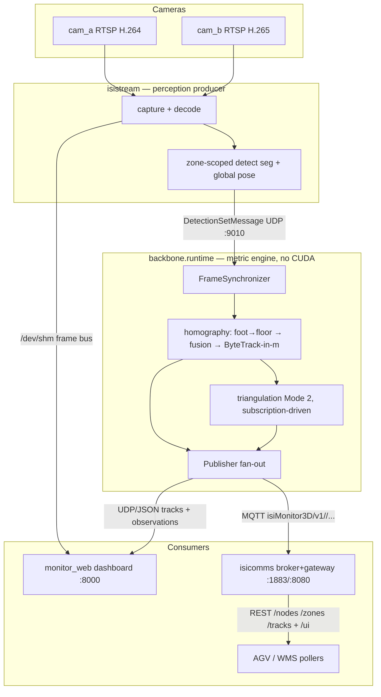

# ISI **Monitor 3D** — the system in one page

**WHY** — know *what* is *where*, in metres, stable identity, real time (Isitec cahier des charges). No cloud, systemd-supervised.

**WHAT** — 1–2 RTSP cameras → `Track2D` (always) + `Track3D` (on-demand), versioned JSON over UDP + MQTT.

**HOW** — Direction-1 split: two processes joined by a UDP loopback contract.

## The four apps

| App | Launch | Role | Port |
|---|---|---|---|
| **isistream** | `python -m isistream --config config/backbone.yaml` | all pixels: capture, decode, `/dev/shm` bus, detect + pose | → :9010 |
| **backbone** | `python -m backbone.runtime --config config/backbone.yaml` | metric engine, no CUDA, ~190 MB | UDP :50001 |
| **monitor_web** | `python -m monitor_web` (alias `3d`) | dashboard; START/STOP spawns both above | :8000 |
| **isicomms** | `docker compose up -d` / `python -m isicomms` | broker + gateway: MQTT in → REST + `/ui` | :1883 / :8080 |

## KPIs

| Indicator | Target | Status |
|---|---|---|
| Latency capture→publish p95 | < 200 ms | p50 77 / p95 126 ms |
| Homography reprojection | ≤ 2 px | e2e green |
| Triangulation gate per view | ≤ 5–8 px | on-rig pending |
| mAP@0.5 | ≥ 0.90 | `pallet3_yolo_seg` |
| Pallet empty/full P / R | ≥ 0.95 / 0.93 | on the wire |

!!! note
    Latency is always vs `frame.capture_ts`, never publish time. Instrument: `tools/latency_probe.py`.

## Modes

| Mode | Cams | Calibration | Output |
|---|---|---|---|
| **1** `single_cam_homography` | 1 | `calibrate single-cam` (≥5 floor points) | `Track2D` only |
| **2** `dual_cam_homography_triangulation` | 2 | Multical joint BA | `Track2D` + `Track3D` |

Camera dies in Mode 2 ⇒ degradation: solo pairs after 100 ms, `Track3D` halts, `track_id`s survive.

## Seven non-negotiables

1. **One calibration, two queries** — `calibration.json` (`K, D, R, t, H, P`) feeds both methods.
2. **One identity space** — ByteTrack owns `track_id`; triangulation never re-IDs.
3. **Subscription, not polling** — `Track3D` per `config/subscriptions.yaml`.
4. **5 plugin seams**, test-pinned — concrete everywhere else.
5. **Contracts, not shared code** — `backbone/comms/schemas.py`.
6. **Fail honestly** — gated outputs, never silent-bad.
7. **Industrial defaults** — systemd, no cloud.
