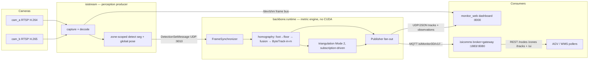

# ISI **Monitor 3D** — the system in one page

**WHY** — Isitec's industrial-vision cahier des charges (`docs/specs/`): a warehouse needs to know *what* is *where*, in **metres**, with **stable identity**, in **real time** — for safety (person↔forklift proximity), pallet/rack state (empty/full), and PLC/WMS/AGV integration. No cloud, systemd-supervised, deterministic restart.

**WHAT** — a Python backbone that turns 1–2 RTSP cameras into metric, identity-stable metadata: `Track2D` (always, from homography) and `Track3D` (on-demand, from triangulation), published as versioned JSON over **UDP** (local consumers) and **MQTT** (the multi-node fabric). Modules (Sécurité, Palettes, Dashboard, PLC gateway) are separate processes consuming only the wire contract.

**HOW** — the Direction-1 split: perception and metric math are **two processes** joined by a UDP loopback contract.

## The four apps

| App | Process | Role | Port |
|---|---|---|---|
| **isistream** | `python -m isistream --config config/backbone.yaml` | Owns ALL pixels: RTSP capture, decode, `/dev/shm` frame bus, zone-scoped seg detection + pose → `DetectionSetMessage` per camera per tick | → UDP :9010 |
| **backbone** (metric engine) | `python -m backbone.runtime --config config/backbone.yaml` | Pure math, ~190 MB RSS, no CUDA: sync → homography → tracking → triangulation → publish | UDP out :50001 |
| **monitor_web** | `python -m monitor_web` (alias `3d`) | Operator dashboard: Pixi floor map, live cams over one `/ws/video` socket, Settings, START/STOP spawns both processes above | :8000 |
| **isicomms** | `docker compose up -d` / `python -m isicomms` | Mosquitto broker + gateway: MQTT in → polling REST out + `/ui` probe | :1883 / :8080 |

## KPIs (acceptance, Backbone v1)

| Indicator | Target | Status |
|---|---|---|
| End-to-end latency capture→publish (p95) | < 200 ms | measured p50 ≈ 77 ms / p95 ≈ 126 ms (points mode) |
| Homography reprojection error | ≤ 2 px | synthetic e2e test green |
| Triangulation reprojection gate (per view) | ≤ 5–8 px | gate implemented, on-rig pending |
| Detection mAP@0.5 | ≥ 0.90 | trained on `pallet3_yolo_seg` |
| Pallet empty/full precision / recall | ≥ 0.95 / ≥ 0.93 | occupancy fields on the wire |

!!! note "Latency is honest"
    Every latency number is measured against `frame.capture_ts` — the single capture-time clock propagated through every downstream message — never against `time.time()` at publish. `tools/latency_probe.py` is the instrument.

## Operational modes

| Mode | Cameras | Calibration | Output |
|---|---|---|---|
| **1** `single_cam_homography` | 1 | `calibrate single-cam` (≥5 floor-point pairs) | `Track2D` only — triangulation stack never built |
| **2** `dual_cam_homography_triangulation` | 2 | Multical joint BA (`calibrate-all` / `calibrate-2cam`) | `Track2D` always + `Track3D` for subscriptions |

One camera dying in Mode 2 ⇒ **runtime degradation**, not failure: solo `FramePair`s after `degraded_emit_after_ms` (100 ms), `Track3D` halts cleanly, `track_id`s survive recovery (Mahalanobis matching).

## Seven non-negotiables

1. **One calibration, two queries** — one `calibration.json` (`K, D, R, t, H, P`) feeds homography *and* triangulation.
2. **One identity space** — homography's ByteTrack owns `track_id`; triangulation never re-IDs.
3. **Subscription, not polling** — `Track3D` computed only for rules in `config/subscriptions.yaml`.
4. **Plugin where multiplicity is real** — exactly 5 ABC seams, pinned by a test. Concrete everywhere else.
5. **Process boundaries are contractual** — zero module imports; `backbone/comms/schemas.py` is the only contract.
6. **Fail honestly** — every geometric output is gated; bad input → no output or flagged, never silent-bad.
7. **Industrial defaults** — systemd, no cloud, latency vs `capture_ts`.
