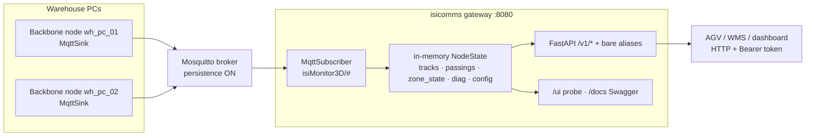

# isicomms — broker & gateway

**WHY** — N Backbone nodes must feed AGVs/WMS/dashboards that poll HTTP and never share code; one module owns the broker, the aggregation, and the REST surface. (Source doc: `isicomms/CHEATSHEET.md`.)

**WHAT** — a central **Mosquitto broker** (`isicomms/deploy/`) + a **gateway REST aggregator** (`isicomms/isicomms/`, uvicorn `:8080`). Nodes publish versioned JSON (see [Wire, MQTT & probe](comms.md)); the gateway folds it into an in-memory per-node cache and serves a polling API.

## Genesis (how it came to be)

1. **Local UDP bus (S6)** — `UdpSink` + `backbone/comms/schemas.py`, one machine, one consumer.
2. **Multi-node** — `MqttSink` registered beside `"udp"` in the same registry: same `Publisher` fan-out, same schemas, zero new contract. A down broker never raises into the pipeline.
3. **Central gateway** — AGVs poll HTTP, they don't hold MQTT subscriptions → `isi_gateway/` aggregator + `deploy/` broker stack (commit `2117d3c`).
4. **The rename** — gateway + deploy merged into ONE detachable module `isicomms/` (commit `0499da1`). The env prefix stayed **`ISI_GATEWAY_`** on purpose — frozen interface (`docs/REUSE.md`).

## The sink seam — `UdpSink` → `MqttSink`

`MetadataSink` is one of the five plugin seams; the orchestrator builds one sink per `metadata.sinks` entry (`"udp"`, `"mqtt"`) and wraps them in `Publisher` (`backbone/comms/publisher.py`) — every `publish_*` fans to every sink, each in its own `try/except`: **one sink failing never suppresses the others**.

**`UdpSink`** (`backbone/comms/udp_sink.py`) — one socket, one JSON datagram per message, fire-and-forget (slow consumers must never back-pressure the pipeline). Fragments payloads > 1300 B ([why](comms.md#fragmentation)). The only sink overriding `publish_observations` — the ABC's no-op default is what keeps the display feed off the broker.

**`MqttSink`** (`backbone/comms/mqtt_sink.py`) — one paho client, one background loop thread. The broker connection is engineered to never touch pipeline uptime:

1. `connect_async` + `loop_start()` — construction never blocks on the network; a paho thread owns the socket.
2. `reconnect_delay_set(1, 30)` — a broker that's down at start or dies mid-run is retried with backoff forever; `_on_disconnect` just logs.
3. Every publish is swallow-and-log — **an outage costs messages, never uptime** (QoS-0 losses are superseded by the next sample; retained state heals on reconnect).
4. **CONNACK race** — `publish_config()` at startup can beat the async connect (a QoS-0 publish on an unconnected socket is silently dropped), so the config advert is cached and re-published in `_on_connect` on every (re)connect.
5. `close()` disconnects *before* `loop_stop()` so the DISCONNECT packet actually reaches the wire.

Topics come from constructor templates (`{prefix}/{cls}/{zone}/{track_id}` tokens, segments sanitized `/ + #` → `_`). QoS/retain strategy: high-rate tracks at QoS 0 non-retained (latest-wins); `zone_state` + `proximity` at QoS 1 **forced-retained** (WMS-consequential absolute state — late joiners read it on subscribe); `config` forced-retained.

## Architecture



- **Stateless on disk** — state lives only in `MqttSubscriber._nodes`; a restart re-subscribes and the broker's **retained** messages (config advert, every `zone/<zone>`, `proximity`) repopulate it immediately.
- **Liveness ≠ eviction** — *stale* after `node_stale_after_s` (15 s, display only); **deleted** after `node_evict_after_s` (86400 s, `0` = never) so decommissioned nodes age out without a restart.
- **Zone state keyed by stable `zone_id`** (`zp_…`), name fallback for legacy payloads — renames never strand an orphan entry.
- **Probe buffers** — raw ring of every arriving message (`recent_buffer` 300, malformed included) + latest-per-topic map → `/recent` and the `/ui` schema tree.

## Topic tree

`<base>/v1/<node_id>/<suffix>` (legacy unversioned parsed as `v0`). `{zone}` = the **stable zone id** (`topic_zone: "id"`; e.g. `zone/zp_mr8z7cot`); `track_id` rides the payload, keeping topics O(classes).

| Suffix | Payload | Retained | QoS |
|---|---|---|---|
| `track2d/<cls>` / `track3d/<cls>` | `Track2DMessage` / `Track3DMessage` | no | 0 |
| `zone/<zone>` | `ZoneStateMessage` (empty = explicit `objects=[]`) | **yes** | 1 |
| `zone/<zone>/passings` | `PassingEventMessage` | no | 0 |
| `zone/<zone>/images/<track_id>` | `ImageRefMessage` (URL, never bytes) | no | 0 |
| `proximity` | `ProximityMessage` | **yes** | 1 |
| `diagnostics/heartbeat` | `DiagnosticsMessage` (every 5 s) | no | 0 |
| `config` | `ConfigMessage` — re-published on every (re)connect | **yes** | 0 |

`observations`, `detection_set`, and `fragment` never ride MQTT — see [the wire page](comms.md).

## What the gateway caches

Full field-level contract: [Wire, MQTT & probe](comms.md). Per type (`MqttSubscriber.update_from_message`):

| Type | Cached as |
|---|---|
| `track_2d` / `track_3d` | `last_track2d_by_id[track_id]` / `last_track3d_by_id[…]` (latest wins) |
| `passing` | `passings` deque (maxlen `passings_buffer` = 200) |
| `zone_state` | `zone_state_by_zone[zone_id or zone]` |
| `diagnostics` / `config` | `last_diagnostics` / `config` |
| `image_ref` | not cached — bumps `last_seen` only |

## REST API

Every router mounts **twice**: under `/v1` and bare (back-compat alias, pinned identical by tests). With `ISI_GATEWAY_API_TOKEN` set, everything except `/healthz` (and the `/ui` shell) needs `Authorization: Bearer <token>`.

| Endpoint | Returns |
|---|---|
| `GET /nodes` | per-node: alive/stale, topic version, mode, p95 + fps |
| `GET /zones` · `GET /zones/{name}` | zone specs + retained state (`objects`/`count`/`state_ts`; `null` state ≠ explicit empty) |
| `GET /tracks?node=&cls=&zone=` | flat latest tracks; `?zone=` = point-in-polygon vs config polygons |
| `GET /passings?limit=&node=` | zone-crossing events, newest last |
| `GET /diagnostics` | freshness + last raw heartbeat per node |
| `GET /config` | raw retained config advert per node |
| `GET /recent?limit=` | raw MQTT tail + latest-per-topic + ingest counters |
| `GET /clients` | REST consumers (keyed by `X-Client-Name` header or IP) + broker MQTT client count (`$SYS`) |
| `GET /healthz` | liveness, tokenless, never touches the broker |
| `GET /ui` | live probe page (nodes/zones/tracks/consumers tables + schema tree + AGV test cards, token box) |
| `GET /test` | redirect → `/ui` (the former AGV console, merged in; `?run=all` preserved) |
| `GET /docs` | Swagger |

!!! note "AGV recipe"
    `curl -H "Authorization: Bearer $TOKEN" http://<gateway>:8080/v1/zones/Sortie_1` — one zone's spec + per-node contents. Or `…/v1/tracks?zone=Sortie_1` for the tracks inside it right now.

## Config (`ISI_GATEWAY_*`)

`host`/`port` (0.0.0.0:8080) · `mqtt_host`/`mqtt_port` (127.0.0.1:1883) · `mqtt_base` (`isiMonitor3D`) · TLS: `mqtt_tls`, `mqtt_ca_cert`, `mqtt_tls_insecure` · `mqtt_username`/`mqtt_password` · `node_stale_after_s` 15 · `node_evict_after_s` 86400 · `passings_buffer` 200 · `recent_buffer` 300 · `api_token` (None = open).

## How the broker is constructed

Not custom code — a stock `eclipse-mosquitto:2` container, constructed entirely by config in two profiles (`isicomms/deploy/`):

| | On-prem (`deploy/onprem/`) | Cloud (`deploy/cloud/`) |
|---|---|---|
| Listener | `1883` plaintext | `8883` TLS only (`gen-certs.sh` certs) |
| Auth | `allow_anonymous true` (trusted LAN) | `allow_anonymous false` + `password_file` (username/password, not client certs) |
| Persistence | `persistence true` → `mosquitto_data` volume — **retained store survives broker restarts** | same |
| Compose | 2 services: broker + gateway (`ISI_GATEWAY_MQTT_HOST: mosquitto`; host ports via `ISICOMMS_*`) | 3 services: broker + gateway (**:8080 not published**) + Caddy HTTPS `:443` — the only public HTTP door |

The gateway image builds from the **repo root** (it needs `backbone.comms.schemas` + `backbone.shared.zones`) — base deps only, no CUDA/OpenCV/GStreamer. Security is functional-first/default-off: the `deploy/README.md` checklist must be green before internet exposure.

## Run · deploy · export · test

```bash
pip install -e isicomms && python -m isicomms          # gateway on :8080
docker compose -f isicomms/deploy/onprem/docker-compose.yml up -d --build   # broker+gateway (LAN)
# cloud profile: MQTTS :8883 + Caddy HTTPS + broker auth + API token (deploy/cloud/)
scripts/export_module.sh isicomms <dest> [onprem|cloud] # self-contained copy (wheels, no repo)
cd isicomms && pytest                                   # 95 green — hermetic (paho mocked)
```

Frozen interface: REST paths, port 8080, the MQTT topic tree, the `ISI_GATEWAY_*` prefix. Docker images are parked (files kept; `--build` recreates).
