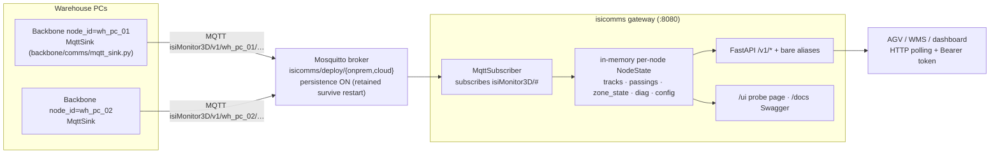

# isicomms — CHEATSHEET

A from-scratch explainer of the ISI Monitor 3D **communication module**: how it
came to be, how it is built, and the contracts it speaks. Every claim below is
cited against the code (paths are repo-relative).

---

## 1. What isicomms is

isicomms is the communication layer of the distributed ISI Monitor 3D system:
a **central Mosquitto MQTT broker** (`isicomms/deploy/`) plus a **gateway REST
aggregator** (`isicomms/isicomms/`). N producer nodes — one Backbone per
warehouse PC, each with a unique `node_id` — publish versioned JSON messages
(tracks, zone state, passings, diagnostics, config) to the broker; the gateway
subscribes to everything, folds it into an in-memory per-node cache, and serves
one **polling REST API** for consumers that can't (or shouldn't) speak MQTT:
free-moving AGVs, dashboards, WMS/FMS. Producers and consumers never share
code — only the schema contract in `backbone/comms/schemas.py`
(architecture principle #5: process boundaries are contractual).

## 2. How it came to be (genesis)

1. **Local UDP/JSON bus (Backbone S6).** The Backbone's only output contract
   was `UdpSink` + the pydantic envelopes in `backbone/comms/schemas.py`,
   fanned out by `backbone/comms/publisher.py`. One machine, loopback
   datagrams, one consumer (the `monitor_web` dashboard).
2. **Multi-node requirement.** Several warehouse PCs had to feed one central
   point (see `docs/architecture-distributed.md`). Answer: `MqttSink`
   (`backbone/comms/mqtt_sink.py`), registered as `"mqtt"` in the same
   `metadata_sink_registry` beside `"udp"` — same `Publisher` fan-out, same
   schemas, zero new contract. A down broker never raises into the pipeline
   (`connect_async` + background loop, swallow-and-log publishes).
3. **Central gateway.** AGVs poll HTTP; they don't hold MQTT subscriptions.
   Commit `2117d3c` ("isi-gateway: central multi-node aggregator + polling
   REST API (Phase 2)") added the consumer-side `isi_gateway/` package +
   a `deploy/` broker stack.
4. **The rename.** Commit `0499da1` ("isicomms: the MQTT broker + gateway unit
   gets its module name") merged gateway + deploy into ONE detachable module,
   `isicomms/`. Traces are still visible: `isicomms/pyproject.toml` has
   `name = "isicomms"`, the module path is `isicomms/isicomms/`, launch is
   `python -m isicomms` — but both `isicomms/isi_gateway.egg-info/` and
   `isicomms/isicomms.egg-info/` sit side by side, and the env prefix stayed
   **`ISI_GATEWAY_`** on purpose (frozen interface, `docs/REUSE.md`:
   "same REST API, same port, same MQTT topics, same env prefix").

## 3. The sink seam — `UdpSink` → `MqttSink`

This is where the code design starts: `MetadataSink` is one of the Backbone's
five plugin seams (`backbone/core/interfaces.py`). The orchestrator builds one
sink per entry in `metadata.sinks` (registry names `"udp"`, `"mqtt"`) and
wraps them in `Publisher` (`backbone/comms/publisher.py`) — a concrete
fan-out that calls every `publish_*` on every sink, each inside its own
`try/except`, so **one sink failing never suppresses the others** (a dead
broker cannot stop UDP, and vice versa).

### `UdpSink` (`backbone/comms/udp_sink.py`, 148 lines)

- One `SOCK_DGRAM` socket, one `(host, port)` target, one JSON datagram per
  message; `sendto` errors are logged and swallowed. UDP is deliberate:
  bus consumers poll at their own cadence, and a slow consumer must never
  back-pressure the pipeline.
- **Application-layer fragmentation** — `send_json_datagram()` slices any
  payload > 1300 B into `FragmentMessage` chunks (WSL2 mirrored networking
  silently drops loopback UDP > ~1.5 KB; mask-polygon observations hit that).
  The function is shared with the Direction-1 producer path so both
  directions stay wire-compatible with `FragmentBuffer`.
- The **only** sink that overrides `publish_observations` — the ABC ships a
  non-abstract no-op default, so `MqttSink` silently inherits "don't": that
  single design choice is what keeps the high-rate display feed off the
  broker.

### `MqttSink` (`backbone/comms/mqtt_sink.py`, 427 lines) — the deep part

**Construction.** Validates `port`/`qos`/`topic_zone` up front (fail-fast on
bad config), then builds ONE paho-mqtt client
(`mqtt.Client(CallbackAPIVersion.VERSION1, client_id=...)`) with optional
`username_pw_set` and TLS (`tls_set(ca_certs=...)`; `tls_insecure_set(True)`
is a dev-only escape hatch). Topic *templates* are constructor args
(`track2d_topic="{prefix}/track2d/{cls}"`, …) with `{prefix}`, `{cls}`,
`{zone}`, `{track_id}` tokens; every substituted segment is sanitized
(`/ + #` → `_`) so operator-typed names can't inject topic separators or
wildcards.

**Connection to the broker — the lifecycle that makes it industrial:**

1. `connect_async(host, port, keepalive=60)` + `loop_start()` — the
   constructor NEVER blocks on the network. A paho background thread owns the
   socket; the pipeline thread only ever enqueues.
2. `reconnect_delay_set(min_delay=1, max_delay=30)` — a broker that is down
   at startup, restarts mid-run, or drops the TCP session is retried with
   exponential backoff forever. `_on_disconnect` with `rc != 0` logs and lets
   paho reconnect; the pipeline never notices.
3. Every `publish_*` is wrapped `try/except` → log WARNING, continue.
   Combined with (1)–(2): **a broker outage costs messages, never uptime**
   (QoS-0 messages during the outage are simply lost; retained state heals on
   reconnect).
4. **The CONNACK race + `_retained_config`.** `publish_config()` is called
   once at orchestrator startup — often *before* the async CONNACK lands. A
   QoS-0 publish on an unconnected socket is silently dropped, so the sink
   caches `(topic, payload)` in `_retained_config` and `_on_connect`
   re-publishes it on EVERY (re)connect. This also restores the advert after
   a broker whose retained store was wiped comes back.
5. `close()` calls `disconnect()` *before* `loop_stop()` so the DISCONNECT
   packet is handed to a still-running network loop and actually reaches the
   wire (mirrored by `MqttSubscriber.stop` on the gateway side).

**Publish semantics per message class:**

| Class | QoS | Retain | Why |
|---|---|---|---|
| `track2d/track3d` (high-rate) | instance `qos` (default 0) | instance `retain` (default off) | latest-wins telemetry; a lost sample is superseded ~70 ms later |
| `zone_state`, `proximity` (low-rate state) | `zone_state_qos` (default 1) | **forced True** | WMS-consequential absolute state — duplicates harmless, loss isn't; late joiners read current contents on subscribe |
| `config` (once + on reconnect) | instance `qos` | **forced True** | the node's self-advert; late-joining gateways need it immediately |
| `passings`, `image_ref`, `diagnostics` | instance `qos` | instance `retain` | events/heartbeats — history is the consumer's job |

## 4. Architecture



Key properties (all in `isicomms/isicomms/mqtt_subscriber.py` unless noted):

- **Stateless on disk.** The gateway persists nothing; `NodeState` lives only
  in `MqttSubscriber._nodes`. On restart it re-subscribes `{base}/#` and the
  broker's **retained** messages (each node's `config` advert, every
  `zone/<zone>` state, `proximity`) repopulate the cache immediately; live
  streams refill the rest. Broker-side `persistence true`
  (`deploy/onprem/mosquitto.conf`) keeps retained state across *broker*
  restarts too.
- **No broker at startup ≠ crash.** `connect_async` + `loop_start` +
  `reconnect_delay_set(1, 10)` — background retries, mirrored on the sink side.
- **Thread safety.** Every read/write goes through `_lock`; `snapshot_nodes()`
  copies the mutable containers **under the lock** so route handlers never race
  the paho network thread. `update_from_message` has no I/O — tests feed it
  directly, no broker.
- **Liveness vs eviction.** A node is *alive* iff seen within
  `node_stale_after_s` (default **15 s**) — `/nodes` reports `alive`/`stale`.
  A node silent beyond `node_evict_after_s` (default **86400 s** = 1 day, 0
  disables) is **deleted** from the store entirely (sweep inside
  `update_from_message`) — a decommissioned node whose retained topics were
  purged ages out without a gateway restart. Pinned by
  `tests/test_mqtt_subscriber.py::test_stale_node_evicted_after_timeout` /
  `::test_node_within_evict_window_is_kept`.
- **Zone state keyed by STABLE id.** `zone_state_by_zone[msg.zone_id or
  msg.zone]` — a zone rename overwrites the same entry instead of stranding an
  old-name orphan; id-less legacy payloads fall back to the name key
  (`::test_zone_state_keyed_by_stable_id_when_present`,
  `::test_zone_state_without_id_falls_back_to_name_key`).
- **Probe buffers.** A raw ring of every arriving message, malformed included
  (`recent_buffer`, default 300) + a latest-per-topic map (`_latest_by_topic`,
  capped at 1000) — these power `/recent` and the `/ui` schema tree.
- **Counters.** `received` / `dropped_malformed` / `dropped_version`
  (`SchemaVersionError` from `parse_envelope`) exposed via `/recent`.

## 5. Topic tree

Topics are `<base>/<version>/<node_id>/<suffix>`; `base` defaults to
`isiMonitor3D`, `version` is `TOPIC_VERSION = "v1"`
(`backbone/comms/schemas.py`) — orthogonal to the payload `SCHEMA_VERSION`.
The publishing node's `MqttSink` is configured with a freeform
`prefix: isiMonitor3D/v1/<node_id>` and does not parse it; the gateway's
`_parse_topic` extracts `(node_id, topic_version)` and accepts the **legacy
unversioned** layout `isiMonitor3D/<node_id>/...` as `topic_version="v0"`
(transition path; surfaced per node in `/nodes` and `/config`).

Defaults from `backbone/comms/mqtt_sink.py` (all templates are config-overridable;
`{cls}`/`{zone}` segments are sanitized — `/ + #` → `_`):

| Topic (under `{prefix}` = `isiMonitor3D/v1/<node_id>`) | Payload | Retained | QoS |
|---|---|---|---|
| `track2d/<cls>` | `Track2DMessage` | no* | instance `qos` (default 0) |
| `track3d/<cls>` | `Track3DMessage` | no* | instance `qos` (0) |
| `zone/<zone>` | `ZoneStateMessage` | **yes (forced)** | `zone_state_qos` (default 1) |
| `zone/<zone>/passings` | `PassingEventMessage` | no* | instance `qos` (0) |
| `zone/<zone>/images/<track_id>` | `ImageRefMessage` (URL only, never bytes) | no* | instance `qos` (0) |
| `proximity` | `ProximityMessage` | **yes (forced)** | `zone_state_qos` (1) |
| `diagnostics/heartbeat` | `DiagnosticsMessage` (every `interval_sec`, default 5 s — `backbone/comms/diagnostics_publisher.py`) | no* | instance `qos` (0) |
| `config` | `ConfigMessage` | **yes (forced)**, cached and **re-published on every (re)connect** (`_on_connect`) so a broker restart or a startup CONNACK race never loses the advert | instance `qos` (0) |

\* follows the instance `retain` flag, default `False`.

- **`<zone>` segment = the STABLE zone id** by default (`topic_zone: "id"`,
  e.g. `zone/zp_mr8z7cot`) so renames never move topics or orphan retained
  state; `topic_zone: "name"` is the legacy rollback. Both id and name are
  always in the JSON payload.
- **`track_id` is in the payload, not the topic** — per-class topics keep
  broker cardinality O(classes), not O(objects).
- **Not on MQTT at all:** `ObservationsMessage` (UDP-only display feed) and
  `DetectionSetMessage` (isistream → Backbone ingest port); `FragmentMessage`
  is a UDP-transport artifact (TCP/MQTT never fragments).

## 6. Schemas (`backbone/comms/schemas.py` — the ONE contract)

`SCHEMA_VERSION = 6`; `parse_envelope(dict)` dispatches on the `type` field and
raises `SchemaVersionError` unless `schema_version ∈ {3, 4, 5, 6}`. All models
are pydantic, `extra="forbid", frozen=True`. Common envelope fields:
`schema_version`, `type`, `ts` (capture-time Unix seconds — the single KPI
clock, except diagnostics/config which use emit-time wall clock). `node_id`
appears **only** in `DiagnosticsMessage`/`ConfigMessage`; for everything else
the gateway derives it from the topic.

What the gateway caches per message type (`MqttSubscriber.update_from_message`):

| Type (`type` field) | Key payload fields | Cached as |
|---|---|---|
| `track_2d` | `track_id, cls, xy_m, vxy_m, confidence, cameras_seeing, occupancy_state/content/confidence` | `last_track2d_by_id[track_id]` (latest wins) |
| `track_3d` | `track_id, cls, xyz_m, vxyz_m, contributing_cameras, max_reprojection_error_px, keypoints_xyz, single_view, confidence` | `last_track3d_by_id[track_id]` |
| `passing` | `track_id, cls, zone, zone_id, direction: enter\|leave` | appended to `passings` deque (maxlen = `passings_buffer`) |
| `image_ref` | `track_id, cls, zone, zone_id, url` | not cached — only bumps `last_seen` |
| `zone_state` | `zone, zone_id, objects: [ZoneObject], count` | `zone_state_by_zone[zone_id or zone]` |
| `diagnostics` | `node_id, mode, sources, frame_count, fps, fps_by_camera, latency_ms{p50,p95,p99,n}, zones, subscriptions, calibration{loaded,rms_ok,mode}` | `last_diagnostics` |
| `config` | `node_id, area, mode, cameras, zones: [ZoneSpec{name, zone_id, kind, type, severity, polygon}], calibration` | `config` |

`zone_id` is additive within v6 (defaulted `""` so pre-id payloads still
parse); consumers MUST key zone semantics on `zone_id` (immutable), never on
`zone` (the renamable operator label).

**Zone state example** — retained on `isiMonitor3D/v1/wh_pc_01/zone/zp_mr8z7cot`
(an *empty* zone is an explicit `objects: [] / count: 0`, never silence):

```json
{
  "schema_version": 6,
  "type": "zone_state",
  "ts": 1753264518.412,
  "zone": "Sortie_1",
  "zone_id": "zp_mr8z7cot",
  "objects": [
    {
      "track_id": 12, "cls": "palette", "confidence": 0.91,
      "xy_m": [3.42, 1.87],
      "occupancy_state": "full", "occupancy_content": "carton",
      "occupancy_confidence": 0.88
    }
  ],
  "count": 1
}
```

**Heartbeat example** — on `isiMonitor3D/v1/wh_pc_01/diagnostics/heartbeat`:

```json
{
  "schema_version": 6,
  "type": "diagnostics",
  "ts": 1753264520.003,
  "node_id": "wh_pc_01",
  "mode": "dual_cam_homography_triangulation",
  "sources": {"cam_a": "alive", "cam_b": "alive"},
  "frame_count": 48210,
  "fps": 14.8,
  "fps_by_camera": {"cam_a": 15.0, "cam_b": 14.9},
  "latency_ms": {"p50": 77.0, "p95": 126.0, "p99": 158.0, "n": 500},
  "zones": 3,
  "subscriptions": 1,
  "calibration": {"loaded": true, "rms_ok": true, "mode": 2}
}
```

## 7. REST API

Every resource router is mounted **twice** (`isicomms/isicomms/app.py`): under
`/v1` (`API_VERSION` in `config.py`) and bare as a back-compat alias — same
handler, pinned identical by `tests/test_app_versioning.py`. Adding `/v2` is
one extra include per router. Auth: when `ISI_GATEWAY_API_TOKEN` is set, every
route below **except `/healthz`** (and the `/ui` HTML shell) requires
`Authorization: Bearer <token>` (`api/auth.py`, 401 otherwise).

| Method | Path (`/v1/...` + bare alias) | Purpose |
|---|---|---|
| GET | `/healthz` | Liveness — always 200, never touches the broker (`routes_health.py`) |
| GET | `/nodes` | Per-node summary: alive/stale, `topic_version`, area/mode/cameras (from config advert), p95 latency + fps (from diagnostics) (`routes_nodes.py`) |
| GET | `/tracks?node=&cls=&zone=` | Flat latest-track list across all nodes, each tagged `node_id`; `?zone=` is point-in-polygon via `backbone.shared.zones.Zone.contains` against config-advert polygons (3D tracks filtered by `xyz_m[:2]`) (`routes_tracks.py`) |
| GET | `/diagnostics` | Per-node freshness + last raw heartbeat (`routes_diagnostics.py`) |
| GET | `/passings?limit=&node=` | Zone-passing events, ts-sorted newest-last, clamped to `passings_buffer` (`routes_passings.py`) |
| GET | `/zones` | Union of all nodes' config zones (global warehouse map), each enriched with the retained zone state: `objects`/`count`/`state_ts` (`null` = no state yet, distinct from explicit empty) (`routes_zones.py`) |
| GET | `/zones/{name}` | One zone by **name** across every node defining it: spec + latest per-node state (joined via `zone_state_by_zone[zone_id]` with name fallback); 404 if unknown (`routes_zones.py`) |
| GET | `/config` | Per-node raw retained `ConfigMessage` + `topic_version` (`routes_config.py`) |
| GET | `/recent?limit=` | Raw MQTT tail (newest last, malformed included) + latest-per-topic map + ingest counters (`routes_ui.py`) |
| GET | `/clients` | Gateway consumers: REST clients tracked by middleware in `app.py` (keyed by the optional `X-Client-Name` header — AGVs are asked to send one — else client IP; `active` = seen ≤ 30 s) + `mqtt_connected`, the broker's `$SYS/broker/clients/connected` count (identities not exposed by Mosquitto; includes the gateway + nodes) (`routes_clients.py`) |
| GET | `/ui` *(bare only, tokenless shell)* | Live probe page — single self-contained HTML string (`api/ui_page.py`, no static files, wheel-safe): nodes/zones/tracks/consumers tables + schema tree (leaf-click = latest payload) + the **AGV test cards** (the former `/test` console, auto-run on load: six RUN checks, each showing the live answer + copyable REST/MQTT/mosquitto_sub addresses), polls every 2 s; sends the Bearer token from a localStorage box |
| GET | `/test` *(bare only)* | 307 redirect → `/ui` (query preserved, so the guide's `/test?run=all` links keep working) — the standalone console was merged into `/ui` |
| GET | `/docs` | FastAPI's built-in Swagger UI (app title "ISI Gateway") |

**AGV recipe** — poll one zone's contents every N ms:

```bash
curl -H "Authorization: Bearer $TOKEN" http://<gateway>:8080/v1/zones/Sortie_1
# → {"name":"Sortie_1","zones":[{ "node_id":"wh_pc_01","zone_id":"zp_mr8z7cot",
#     "polygon":[...], "objects":[...], "count":1, "state_ts":...}],"count":1}
# or: which tracks are inside it right now
curl -H "Authorization: Bearer $TOKEN" "http://<gateway>:8080/v1/tracks?zone=Sortie_1"
```

## 8. Configuration (`isicomms/isicomms/config.py`, env prefix `ISI_GATEWAY_`)

| Setting (env = `ISI_GATEWAY_<UPPER>`) | Default | Meaning |
|---|---|---|
| `host` | `0.0.0.0` | HTTP bind address |
| `port` | `8080` | HTTP port |
| `mqtt_host` | `127.0.0.1` | Broker host |
| `mqtt_port` | `1883` | Broker port |
| `mqtt_base` | `isiMonitor3D` | Topic root; subscribes `<base>/#` |
| `mqtt_tls` | `False` | TLS to the broker |
| `mqtt_ca_cert` | `None` | CA path (None = system CAs) |
| `mqtt_tls_insecure` | `False` | Skip hostname verification (dev only) |
| `mqtt_username` / `mqtt_password` | `None` | Broker credentials |
| `node_stale_after_s` | `15.0` | Display staleness (alive vs stale) |
| `node_evict_after_s` | `86400.0` | Hard eviction from the store (0 = never) |
| `passings_buffer` | `200` | Per-node passings deque length |
| `recent_buffer` | `300` | Raw-tail ring size behind `/recent` and `/ui` |
| `api_token` | `None` | Bearer token; None = open API |

## 9. How the broker is constructed

The broker is **not custom code** — it's a stock `eclipse-mosquitto:2`
container *constructed entirely by configuration*, in two profiles under
`isicomms/deploy/`:

**On-prem profile** (`deploy/onprem/` — trusted LAN, the current default):

- `mosquitto.conf`: `listener 1883` (plaintext) · `persistence true` +
  `persistence_location /mosquitto/data/` — **the broker's retained store
  survives restarts**, which is what lets a reconnecting gateway learn every
  node's config/zone-state instantly · `allow_anonymous true` (LAN dev only;
  the production block — `password_file`, TLS `listener 8883` + certs — sits
  commented in the same file as the upgrade path).
- `docker-compose.yml`: two services. `mosquitto` mounts the conf read-only
  and a named volume `mosquitto_data` (the persistence store); `gateway`
  builds from the **repo root** (`context: ../../..` — the image needs the
  `backbone` package for `backbone.comms.schemas` + `backbone.shared.zones`)
  and points at the broker by service name (`ISI_GATEWAY_MQTT_HOST:
  mosquitto`). Host ports are overridable (`ISICOMMS_MQTT_PORT`,
  `ISICOMMS_GATEWAY_PORT`) without touching container-internal ports.

**Cloud profile** (`deploy/cloud/` — internet-facing):

- `mosquitto.conf`: TLS-only `listener 8883` (`cafile/certfile/keyfile` from
  `./gen-certs.sh`), `require_certificate false` (clients authenticate by
  username/password, not client certs), `allow_anonymous false` +
  `password_file` (minted with `mosquitto_passwd`), same persistence block.
- `docker-compose.yml`: three services — `mosquitto` (MQTTS :8883),
  `gateway` (TLS + credentials + `ISI_GATEWAY_API_TOKEN` from `.env`;
  **:8080 is NOT published to the host**), and `caddy` (HTTPS :443 reverse
  proxy — the only public HTTP door). Backbone nodes connect to
  `<host>:8883`; AGVs poll `https://<host>/...` with the Bearer token.

Security is **functional-first / default-off**: everything (broker auth,
broker TLS, API token) is config/env; the checklist in `deploy/README.md`
must be green before any internet exposure.

## 10. Run / deploy / export / test

**Run natively** (the stale README still says `pip install -e isi_gateway` /
`python -m isi_gateway` — the real names since the rename are):

```bash
conda activate monitor3d
pip install -e isicomms          # one-time, from repo root (pyproject name: isicomms)
python -m isicomms               # uvicorn on :8080 (isicomms/__main__.py → main.py)
# point it at a broker:
ISI_GATEWAY_MQTT_HOST=192.168.1.10 python -m isicomms
```

**Broker + gateway stack** (`isicomms/deploy/`, see `deploy/README.md`):

```bash
# On-prem (LAN, plaintext, anonymous): broker :1883, API+/ui :8080
docker compose -f isicomms/deploy/onprem/docker-compose.yml up -d --build
# host ports overridable: ISICOMMS_GATEWAY_PORT / ISICOMMS_MQTT_PORT

# Cloud (internet-facing): MQTTS :8883 + Caddy HTTPS :443 + API token
cd isicomms/deploy/cloud && CERT_HOST=<host> ./gen-certs.sh
# mosquitto_passwd → passwd; cp .env.example .env and fill it
docker compose -f docker-compose.yml up -d --build
```

(Broker/compose anatomy, security posture, and the repo-root build context are
§9. The gateway image itself is base deps only — no CUDA/OpenCV/GStreamer.
**Docker status July 2026:** the stack is *parked* — all files kept and
functional, images deleted for disk pressure; `--build` recreates them.)

**Export a self-contained copy** (`scripts/export_module.sh`, `docs/REUSE.md`):

```bash
scripts/export_module.sh isicomms <dest-dir> [onprem|cloud]
```

builds the backbone + isicomms **wheels** into `<dest>/isicomms-portable/wheels/`,
copies the chosen deploy profile, writes a `Dockerfile.portable` that installs
only from the bundled wheels (no repo checkout needed), and rewrites the
compose `build:` to point at it. Frozen interface: REST paths, port 8080, the
MQTT topic tree, and the `ISI_GATEWAY_*` env prefix.

**Tests** — `cd isicomms && pytest`: **95 tests, all green** (verified
2026-07). Hermetic by construction: `tests/conftest.py` replaces the paho
client with `lambda *a, **k: MagicMock()` (never a spec'd mock — passing
`CallbackAPIVersion` positionally to `MagicMock` would spec it and break), and
all state tests feed `update_from_message` directly. Guarantees pinned:
per-node isolation, latest-track-wins, passings maxlen, zone_state keyed by
stable `zone_id` (name fallback), node eviction after `node_evict_after_s`,
topic-version parsing (v1 + legacy v0 + malformed → dropped), `/v1` ==
bare-alias shape, tokenless `/ui` shell vs token-guarded `/recent`, and import
discipline (`tests/test_import_discipline.py`: `backbone.runtime` must never
enter `sys.modules` — the gateway imports only `backbone.comms.schemas` +
`backbone.shared.zones`).
